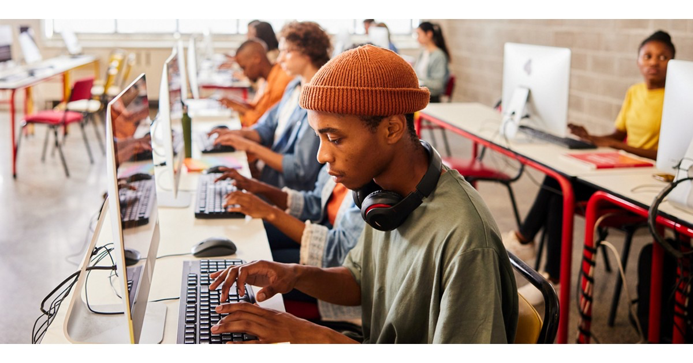

# Africa Funding Finder

A comprehensive web application designed to help nonprofits, NGOs, and organizations find funding opportunities for digitalization projects across Africa. Built for **Diva Laser Foundation** by Bertin Tshisuaka.



## 🌍 Overview

The Africa Funding Finder is a powerful platform that aggregates funding sources, grants, banks, and financial institutions supporting digital transformation across the African continent. With a focus on bridging the digital gap, this application provides detailed information about funding opportunities, application processes, and success strategies.

## ✨ Features

### 🔐 Secure Authentication
- PIN-based login system (4-digit code: 3495)
- Secure session management
- Error handling with contact support information

### 💰 Comprehensive Funding Database
- **15+ Major Funding Sources** including:
  - World Bank
  - African Development Bank (AfDB)
  - USAID
  - Bill & Melinda Gates Foundation
  - Mastercard Foundation
  - Google.org
  - Microsoft Philanthropies
  - And more...

### 🔍 Advanced Search & Filtering
- Search by name, organization, or focus area
- Filter by:
  - Type (Government, Foundation, Bank, etc.)
  - Region (Pan-African, East Africa, West Africa, etc.)
  - Deadline type (Rolling, Annual, Quarterly)
- Real-time results display

### 📊 Real-Time News & Activities
- Latest funding announcements
- Success stories and impact metrics
- Upcoming funding opportunities
- Live statistics dashboard showing:
  - Total funding in 2025
  - Projects funded
  - People benefited
  - Countries reached

### 🌐 Global & Regional Statistics
- **World Statistics**: Digital transformation data for 20+ countries
- **African Regional Analysis**:
  - East Africa
  - Central Africa
  - Southern Africa
  - Special DRC section with leadership profiles

### 🎯 Detailed Funding Information
Each funding source includes:
- Grant ranges and amounts
- Focus areas
- Eligible applicants
- Application process
- Selection criteria
- Success tips
- Direct website links

### 🌍 Bilingual Support
- Full English and French translations
- Easy language toggle (EN/FR)
- All content translated including:
  - UI elements
  - Funding information
  - News and statistics
  - Contact forms

### 🎤 Founder Section
- Bilingual speech (English/French)
- AI-generated audio narration
- Mission statement
- Professional credentials

### 📧 Contact Form
- Direct email integration
- Organization-specific inquiries
- Professional support contact

## 🛠️ Technology Stack

### Frontend
- **React 19** - Modern UI library
- **TypeScript** - Type-safe development
- **Tailwind CSS 4** - Utility-first styling
- **shadcn/ui** - Beautiful component library
- **Wouter** - Lightweight routing
- **Lucide React** - Icon system

### Build Tools
- **Vite** - Fast build tool and dev server
- **ESLint** - Code quality
- **PostCSS** - CSS processing

### Features
- Responsive design (mobile, tablet, desktop)
- Dark theme optimized
- Accessible UI components
- Fast page loads
- SEO optimized

## 📦 Installation

### Prerequisites
- Node.js 22.13.0 or higher
- pnpm (recommended) or npm

### Setup

1. **Clone the repository**
```bash
git clone https://github.com/bertintshisuaka2/Founding-Digital.git
cd Founding-Digital
```

2. **Install dependencies**
```bash
pnpm install
# or
npm install
```

3. **Start development server**
```bash
pnpm dev
# or
npm run dev
```

4. **Build for production**
```bash
pnpm build
# or
npm run build
```

5. **Preview production build**
```bash
pnpm preview
# or
npm run preview
```

## 🚀 Usage

### Accessing the Application

1. Navigate to the application URL
2. Enter the 4-digit PIN: **3495**
3. Browse funding opportunities
4. Use search and filters to find relevant sources
5. Click "View Details" for comprehensive information
6. Toggle language using EN/FR buttons in top-right corner

### Finding Funding

1. **Search**: Type keywords in the search bar
2. **Filter**: Use dropdown filters for Type, Region, and Deadline
3. **Browse**: Scroll through funding cards
4. **Details**: Click "View Details" for full information
5. **Apply**: Visit the funding source website directly

### Language Switching

- Click **EN** for English
- Click **FR** for French
- All content updates instantly

## 📂 Project Structure

```
africa-funding-finder/
├── client/
│   ├── public/              # Static assets
│   │   ├── funding-database.json
│   │   ├── news-activities.json
│   │   ├── world-stats.json
│   │   ├── africa-regions.json
│   │   └── images/
│   ├── src/
│   │   ├── components/      # React components
│   │   │   ├── ui/         # shadcn/ui components
│   │   │   ├── Login.tsx
│   │   │   ├── FundingCard.tsx
│   │   │   ├── NewsActivities.tsx
│   │   │   ├── WorldStats.tsx
│   │   │   ├── AfricaRegions.tsx
│   │   │   ├── FounderSection.tsx
│   │   │   ├── ContactForm.tsx
│   │   │   └── LanguageSwitcher.tsx
│   │   ├── contexts/       # React contexts
│   │   │   ├── ThemeContext.tsx
│   │   │   └── LanguageContext.tsx
│   │   ├── pages/          # Page components
│   │   │   ├── Home.tsx
│   │   │   └── NotFound.tsx
│   │   ├── App.tsx
│   │   ├── main.tsx
│   │   └── index.css
│   └── index.html
├── package.json
└── README.md
```

## 🎨 Design Features

- **Color Scheme**: 
  - Green and black gradient headers
  - Yellow accent colors
  - Dark theme throughout
  - High contrast for readability

- **Typography**:
  - Inter font family
  - Clear hierarchy
  - Responsive sizing

- **Layout**:
  - Asymmetric hero section
  - Card-based funding display
  - Tabbed regional statistics
  - Fixed navigation elements

## 🔒 Security

- PIN-based authentication
- Session management with localStorage
- Secure form handling
- No sensitive data exposure

## 📱 Responsive Design

- Mobile-first approach
- Tablet optimization
- Desktop full-feature experience
- Touch-friendly interfaces

## 🌟 Key Highlights

- **15 Funding Sources** with detailed information
- **$100M+** in available funding tracked
- **20+ Countries** with digital statistics
- **Bilingual** English/French support
- **Real-time** news and updates
- **AI-generated** founder speech in 2 languages

## 👨‍💻 Developer

**Bertin Tshisuaka**
- Founder and President of Diva Laser
- Software Engineer and Full Stack Web Developer
- Georgia Institute of Technology
- University of Phoenix
- Based in Atlanta, Georgia, USA

## 📞 Contact

**Email**: bertintshisuaka@hotmail.com  
**Phone**: +1 (678) 979-6811  
**Location**: Atlanta, Georgia, USA

## 📄 License

© 2025 Diva Laser Software Solutions. All rights reserved.

## 🙏 Acknowledgments

- Funding data sourced from official organization websites
- Digital transformation statistics from World Bank and regional development banks
- Leadership photos from official government sources
- Campus images from Georgia Tech and University of Phoenix

## 🚧 Future Enhancements

- [ ] User accounts and saved searches
- [ ] Email notifications for new funding opportunities
- [ ] Application deadline reminders
- [ ] Success story submissions
- [ ] Grant writing resources
- [ ] Community forum
- [ ] Mobile app version

## 📊 Impact

This platform aims to:
- Connect African nonprofits with funding sources
- Reduce information barriers
- Accelerate digital transformation
- Support sustainable development goals
- Bridge the digital divide across Africa

---

**Built with ❤️ for Africa's Digital Future**

